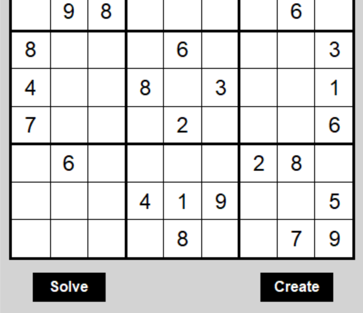

<a id="readme-top"></a>

<!-- PROJECT LOGO -->
<br />
<div align="center">
    <a href="https://github.com/tzada8/sudoku-solver">
        
    </a>
    <h3 align="center">Sudoku Solver: Solve any Sudoku board with ease</h3>
    <p align="center">
        Sudoku Solver provides users with the ability to solve any Sudoku puzzle with ease. Anytime they get stuck on a puzzle and cannot solve the board, this application provides that assistance.
    </p>
</div>

<!-- TABLE OF CONTENTS -->
<details>
    <summary>Table of Contents</summary>
    <ol>
        <li>
            <a href="#about-the-project">About The Project</a>
        </li>
        <li>
            <a href="#getting-started">Getting Started</a>
            <ul>
                <li><a href="#installations">Installations</a></li>
                <li><a href="#backend-setup">Backend Setup</a></li>
            </ul>
        </li>
        <li>
            <a href="#starting-the-app">Starting the App</a>
            <ul>
                <li><a href="#backend-startup">Backend Startup</a></li>
            </ul>
        </li>
        <li>
            <a href="#testing">Testing</a>
            <ul>
                <li><a href="#backend-tests">Backend Tests</a></li>
            </ul>
        </li>
    </ol>
</details>


<!-- ABOUT THE PROJECT -->
## About The Project

<div align="center">
    
</div>
<br/>

Sudoku Solver helps users solve puzzles for them. If no solution exists, the application notifies the user.

Users can either solve the current board or create a new board layout. When creating a board layout, users can insert numbers within each cell of the Sudoku board. Similarly, when solving the current board, users can specify if they are interested in visually seeing the backtracking algorithm in action or if they would prefer to just see the final solution.

Visually displaying the backtracking algorithm will show green and red cells, depicting the cells that were just placed or removed in order to reach the valid solution.

<p align="right">(<a href="#readme-top">back to top</a>)</p>


<!-- GETTING STARTED -->
## Getting Started

### Installations

Ensure the following application is locally installed:

- [Python](https://www.python.org/downloads/)

### Backend Setup

Follow the steps listed below to setup your backend environment.

1. Create a local virtual environment
    ```
    python3 -m venv .venv
    ```
2. Activate the virtual environment
    ```
    source .venv/bin/activate
    ```
3. When needed, deactivate the local virtual environment
    ```
    deactivate
    ```

<p align="right">(<a href="#readme-top">back to top</a>)</p>


<!-- STARTING THE APP -->
## Starting the App

### Backend Startup

1. Activate your virtual environment
    ```
    source .venv/bin/activate
    ```
2. Start the application
    ```
    python3 main.py
    ```

<p align="right">(<a href="#readme-top">back to top</a>)</p>


<!-- TESTING -->
## Testing

### Backend Tests

1. Activate your virtual environment
    ```
    source .venv/bin/activate
    ```
2. Run the tests
    ```
    python3 -m unittest discover -s tests
    ```

<p align="right">(<a href="#readme-top">back to top</a>)</p>
